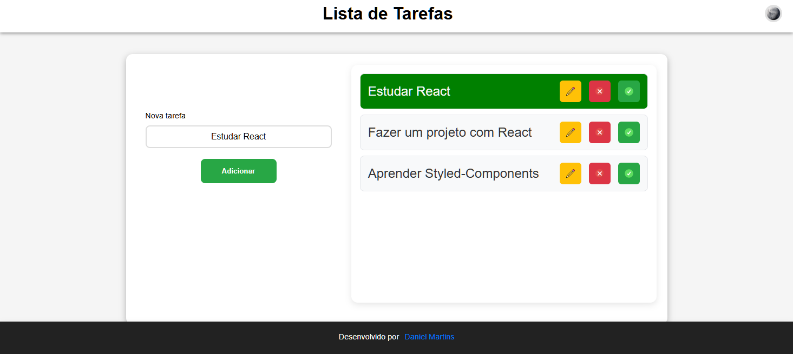
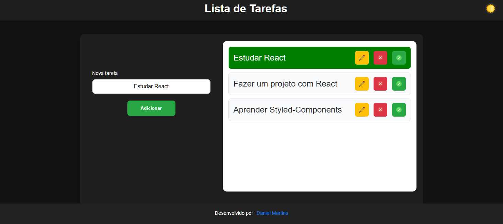
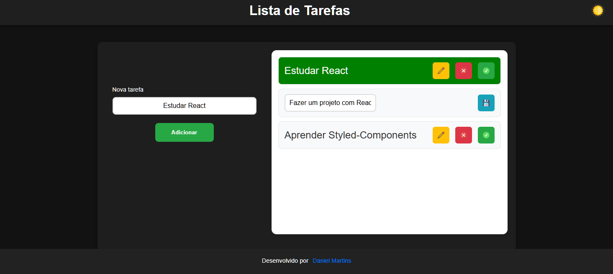

# 📝 Todo List React

Uma aplicação moderna e responsiva de gerenciamento de tarefas (Todo List) construída com React 19, Vite e Styled-Components. Com interface intuitiva, modo escuro/claro e notificações interativas.

<div align="center">


---

### 🌐 [Acesse Agora - https://danielmartins22.github.io/todo-list-react/](https://danielmartins22.github.io/todo-list-react/)

</div>

---

## 📸 Screenshots

### Página Inicial


### Com Tarefas


### Tarefa Concluída


### Modo Escuro


### Modo Edição


---

## ✨ Funcionalidades

- ✅ **Adicionar Tarefas** - Crie novas tarefas de forma rápida e fácil
- ✏️ **Editar Tarefas** - Modifique suas tarefas a qualquer momento
- 🗑️ **Deletar Tarefas** - Remova tarefas que não são mais necessárias
- ✔️ **Marcar como Concluída** - Acompanhe o progresso de suas tarefas
- 🌙/☀️ **Modo Escuro/Claro** - Alterne entre temas de acordo com sua preferência
- 💾 **Persistência de Tema** - Suas preferências são salvas no localStorage
- 🔔 **Notificações Toast** - Feedback visual para todas as ações
- 📱 **Design Responsivo** - Funciona perfeitamente em qualquer dispositivo

---

## 🚀 Tecnologias Utilizadas

- **React 19.2** - Framework JavaScript para construir interfaces
- **Vite 8.1** - Build tool rápido e moderno
- **Styled-Components 6.4** - CSS-in-JS para estilização
- **React-Toastify 11.1** - Sistema de notificações
- **ESLint** - Linter de código
- **Biome** - Formatador e linter rápido

---

## 📋 Pré-requisitos

- Node.js >= 18.x
- npm ou pnpm

---

## 🛠️ Instalação

### 1. Clone o repositório

Escolha uma das opções abaixo:

**Option A - Com HTTPS (recomendado para começar):**
```bash
git clone https://github.com/danielmartins22/todo-list-react.git
cd todo-list-react
```

**Option B - Com SSH (se você já tem SSH configurado):**
```bash
git clone git@github.com:danielmartins22/todo-list-react.git
cd todo-list-react
```

### 2. Instale as dependências

Com **npm**:
```bash
npm install
```

Com **pnpm** (mais rápido):
```bash
pnpm install
```

---

## 💻 Desenvolvimento

### Iniciar o servidor de desenvolvimento

```bash
npm run dev
# ou
pnpm dev
```

O aplicativo estará disponível em `http://localhost:5173`

### Verificar e corrigir código

```bash
npm run lint
# ou
pnpm lint
```

### Formatar código

```bash
npm run format
# ou
pnpm format
```

### Build para produção

```bash
npm run build
# ou
pnpm build
```

### Preview da build

```bash
npm run preview
# ou
pnpm preview
```

---

## 🚀 Deploy no GitHub Pages

### 1. Configurar GitHub Pages

1. Vá para **Settings** do seu repositório
2. Navegue até **Pages** (no menu lateral esquerdo)
3. Em "Build and deployment":
   - **Source**: Selecione `GitHub Actions`
   - **Branch**: `main` (ou sua branch padrão)

### 2. Configurar o Workflow

O GitHub Actions automatizará o build e deploy. Crie o arquivo `.github/workflows/deploy.yml`:

```yaml
name: Deploy to GitHub Pages

on:
  push:
    branches: [main]
  pull_request:
    branches: [main]

jobs:
  deploy:
    runs-on: ubuntu-latest

    steps:
      - uses: actions/checkout@v4

      - name: Setup Node.js
        uses: actions/setup-node@v4
        with:
          node-version: '18'

      - name: Install dependencies
        run: npm install

      - name: Build
        run: npm run build

      - name: Deploy to GitHub Pages
        uses: peaceiris/actions-gh-pages@v4
        with:
          github_token: ${{ secrets.GITHUB_TOKEN }}
          publish_dir: ./dist
          base_path: /todo-list-react
```

### 3. Fazer Push do Código

```bash
git add .
git commit -m "Configurar GitHub Actions para deploy"
git push origin main
```

### 4. Monitorar o Deploy

1. Vá à aba **Actions** do seu repositório
2. Veja a workflow em execução
3. Após completar (✅), seu site estará online

### 5. Acessar o Site

```
https://danielmartins22.github.io/todo-list-react/
```

> ⏱️ **Tempo de espera**: 2-5 minutos para o GitHub processar o build

### ⚠️ Troubleshooting

| Problema | Solução |
|----------|---------|
| Build falha | Verifique `npm run build` localmente |
| Site em branco | Confirme que `base: '/todo-list-react/'` está em `vite.config.js` |
| Workflow não executa | Verifique se o arquivo está em `.github/workflows/deploy.yml` |
| Erro 404 | Aguarde mais alguns minutos para o deploy completar |

---

## 📁 Estrutura do Projeto

```
todo-list-react/
├── src/
│   ├── components/
│   │   └── ToastContainer/          # Componente de notificações
│   │       ├── index.jsx
│   │       └── styles.js
│   ├── helpers/
│   │   └── toastHelper.js           # Funções auxiliares de toast
│   ├── pages/
│   │   └── TodoList/                # Página principal
│   │       ├── index.jsx
│   │       └── styles.js
│   ├── styles/
│   │   ├── GlobalStyles.js          # Estilos globais
│   │   └── theme.js                 # Temas (claro/escuro)
│   ├── assets/                      # Imagens e ícones
│   └── main.jsx                     # Ponto de entrada
├── public/                          # Arquivos estáticos
├── vite.config.js                   # Configuração Vite
├── eslint.config.js                 # Configuração ESLint
├── biome.json                       # Configuração Biome
├── package.json
└── README.md
```

---

## 🎮 Como Usar

1. **Adicionar uma tarefa**: Digite sua tarefa no campo de entrada e clique no botão "Adicionar"
2. **Editar uma tarefa**: Clique no ícone de editar, modifique o texto e salve
3. **Marcar como concluída**: Clique no ícone de checkmark para marcar como feita
4. **Deletar uma tarefa**: Clique no ícone de lixeira para remover
5. **Alternar tema**: Use o ícone de lua/sol no cabeçalho

---

## 🎨 Temas

A aplicação suporta dois temas:

- **Tema Claro** - Perfeito para uso durante o dia
- **Tema Escuro** - Confortável para uso noturno

Suas preferências de tema são salvas automaticamente no localStorage e restauradas ao retornar ao aplicativo.

---

## 📦 Scripts Disponíveis

| Script | Descrição |
|--------|-----------|
| `npm run dev` | Inicia o servidor de desenvolvimento |
| `npm run build` | Compila o projeto para produção |
| `npm run preview` | Visualiza o build de produção |
| `npm run lint` | Verifica e corrige problemas de código |
| `npm run format` | Formata o código automaticamente |
| `npm run check` | Executa verificações com Biome |

---

## 🤝 Contribuindo

Contribuições são bem-vindas! Sinta-se à vontade para:

1. Fazer um fork do projeto
2. Criar uma branch para sua feature (`git checkout -b feature/AmazingFeature`)
3. Commit suas mudanças (`git commit -m 'Add some AmazingFeature'`)
4. Push para a branch (`git push origin feature/AmazingFeature`)
5. Abrir um Pull Request

---

## 👨‍💻 Autor

**Daniel Martins** - Frontend Developer

- LinkedIn: [@danielmartins-frontend](https://www.linkedin.com/in/danielmartins-frontend/)
- 
---

<div align="center">

Made with ❤️ by Daniel Martins

</div>
